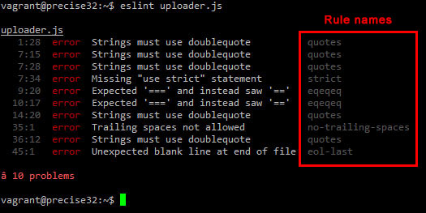

## The Importance of Coding Standards: More Than Just Trivial Rules

Coding standards are often considered trivial concerns, such as how many blank lines to include, where to place curly braces or the age-old argument of tabs or spaces. While many of these rules may seem small and pointless, the broader purpose of coding standards is far from trivial. Following well-defined coding guidelines helps keep code organized, readable, and maintainable. It also promotes collaboration among developers, reduces the likelihood of introducing bugs, and ultimately leads to higher-quality software.

## Balancing the Trivial with the Essential

While some ESLint rules, such as limiting how many empty lines you can have, may feel unnecessary, most coding standards serve a much larger purpose. Developers ensure consistency across a project or company by maintaining a structured coding style. This makes it easier for teams to work together without taking time to understand different personal coding styles. Additionally, standardization helps prevent issues from inconsistent syntax, making debugging, the job of code reviewers, and future optimizations much smoother.

Another significant benefit of coding standards is their role in onboarding new developers. When a project follows a clear set of guidelines, new contributors can quickly familiarize themselves with the existing codebase without struggling to interpret different programming styles. This leads to greater efficiency and productivity within a team and reduces the learning curve for new members.

## First Impressions of ESLint

After my first week using ESLint with VSCode, my overall impression has been positive. The tool is relatively easy to understand and use, even for those new to linting. The instant feedback ESLint provides helps enforce good coding practices without requiring constant manual review. While some errors can be frustrating to fix, most take only seconds to resolve, thanks to automation tools like npm run lint --fix, which automatically corrects many common issues.

One of the most valuable aspects of ESLint is its ability to catch subtle mistakes that might otherwise go unnoticed, such as missing semicolons, unused variables, or inconsistent indentation. These minor issues can add up over time, leading to technical debt and code that becomes increasingly difficult to maintain. By addressing them early, ESLint helps keep the codebase clean and error-free.

## The Real-World Benefits of Coding Standards

Coding standards are essential beyond individual convenience. In professional software development, teams often work on the same codebase over extended periods. Managing the code can quickly become problematic without a standardized approach, especially as new developers join a project. Coding standards help mitigate these issues by ensuring everyone follows a consistent style, reducing unnecessary friction in the development process.

Moreover, maintaining coding standards can help prevent technical debt, accumulating poorly written code that becomes difficult to modify over time. By enforcing best practices early on, developers can avoid situations where fixing a bug or adding a new feature requires untangling a confusing or inconsistent codebase.

Furthermore, coding standards are crucial for ensuring software security. Poorly formatted or inconsistent code can introduce vulnerabilities that make applications susceptible to exploits. By following strict coding guidelines, developers can minimize the risk of security loopholes and improve overall software integrity.

Another often overlooked advantage of coding standards is their impact on performance optimization. Well-structured, standardized code is typically more efficient and easier to profile for performance bottlenecks. Teams that adhere to coding best practices can better optimize their applications, leading to faster execution times and reduced resource consumption.

## How ESLint Fits into the Bigger Picture

ESLint is one of many tools that help developers maintain coding standards, but its role in modern software development is significant. By integrating ESLint into the development workflow, teams can ensure that their code remains consistent, clean, and maintainable throughout a project's lifecycle. Additionally, ESLint can be customized to fit specific project requirements, allowing developers to enforce rules that align with their team's coding philosophy.

Beyond ESLint, there are many other code formatters designed for different programming languages, such as Prettier for JavaScript, Pylint for Python, and Checkstyle for Java. Collectively, these tools contribute to a culture of code quality and professionalism in software development.

## Conclusion

While some aspects of coding standards may feel trivial, their impact on software quality, collaboration, and maintainability is undeniable. ESLint, despite minor annoyances, is a valuable tool that ensures adherence to these standards with minimal effort. By embracing coding standards, developers can create more efficient, reliable, and scalable software, ultimately improving the development process.

Coding standards are more than arbitrary rules; they represent a commitment to writing better software. By understanding their significance and leveraging tools like ESLint, developers can streamline their workflow, reduce errors, and build robust, secure, and future-proof applications.

*ChatGPT used to prevent repetition and to improve grammar*
