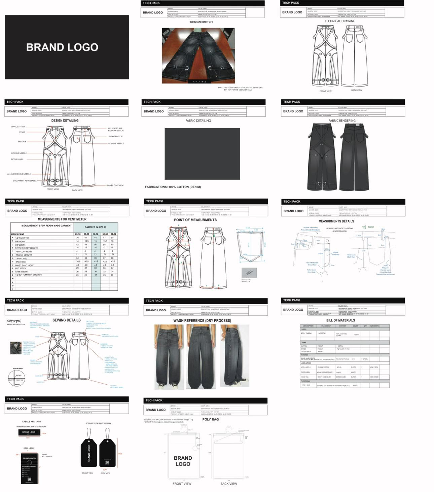

SlantedFaceOfficial was a collaborative venture initiated by my best friend, Evan Liu, and me. Our goal was to create a brand with a design language that resonated deeply with both of us, reflecting our personal aesthetics and values. What started as a passion project quickly became an invaluable learning experience that provided us with firsthand insights into the complexities of launching and managing an online clothing brand.

Throughout the journey, we encountered numerous challenges and gained knowledge in various aspects of business operations. We learned the intricacies of building an e-commerce website and understanding the associated costs and expenses that arise even before producing the actual clothing. From domain registration and web hosting to marketing and operational costs, we developed a comprehensive understanding of the financial demands of running an online business.

On the technical side, we delved into essential clothing production processes, including creating tech packs, pattern designing, and sampling. These steps were crucial in transforming our design concepts into tangible products. Additionally, we navigated the complexities of communicating effectively with manufacturers, ensuring that our vision translated accurately from design to production.

Financial management played a pivotal role in our project. With limited funding from our savings, we learned how to optimize pricing strategies, allocate resources efficiently, and plan budget-friendly product drops. Despite working within financial constraints, we successfully executed two product drops, carefully balancing quality and affordability.

After two successful drops, we ultimately achieved a net break-even point of $200. However, due to limited funds and increasingly demanding personal schedules, we decided to conclude our SlantedFaceOfficial endeavor.

Although the brand is no longer active, the experience gave us invaluable entrepreneurship, branding, and resilience lessons. The journey of SlantedFaceOfficial strengthened our problem-solving abilities, financial literacy, and business skills that will undoubtedly influence our future ventures.

Below is one of the tech packs we created for a product that never made it past sampling:

